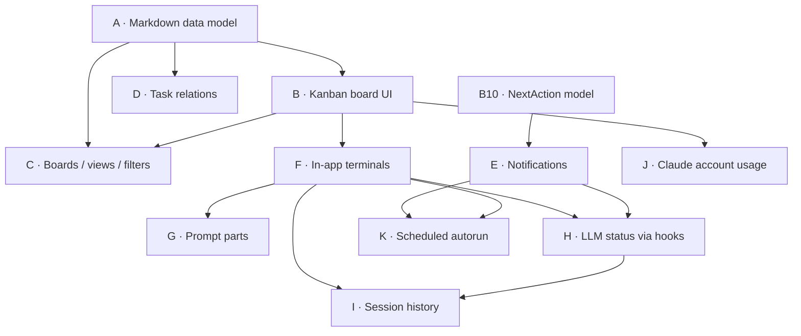

# DEPENDENCIES

The graph that makes the menu correct: pick a feature and you must also build its
prerequisites. The resolver ([`prompts/00-resolve.md`](prompts/00-resolve.md))
reads the adjacency list below and returns the transitive closure in build order.

## Layered view (epics)



**Read it as:** A is the ground floor (everything needs it). B is the UI on top.
C/D extend A+B. E needs only the NextAction model. **F (terminals) is the hard
gate** — G, H, and I are impossible without it, because the Claude hooks that
power live status only fire when the in-app terminal exports `TASKS_TASK_ID`.

## Adjacency list (machine-readable — the resolver uses this)

Format: `FEATURE: prereq, prereq, …` (empty = no prerequisites).

```
A01:
A02:
A03: A02
A04: A02
A05: A02
A06:
A07: A02
A08: A01
A09: A01
A10: A09
A11: A09
B01: A02, A04
B02: B01
B03: B01, A03
B04: A02
B05: A02
B06: A01
B07: B06
B08: B06
B09: A01
B10: A02
B11: A01
B12: B01, B06
B13: B12
C01: A02, B01
C02: C01
C03: C01
C04: C01, B06
C05: C01
D01: A02
D02: D01, B06
D03: D01
D04: D01
E01: B10
E02: E01
E03: E01
F01: B12
F02: F01
F03: F01
F04: F01
F05: F04
F06: F04
F07: F06
F08: F06
F09: F01, A04
F10: F04
F11: F04, H01
F12: F02
G01: A01
G02: G01, F01
H01: B02
H02: H01
H03: F02, H02
H04: H03
H05: H04
H06: H03
H07: H03, E01
H08: F05, H03
H09: H08
H10: H04
I01: F02, H03
I02: I01
J01: B01
K01: E01, E03, F09, F12
```

## Build-order guarantee

The resolver performs a topological sort over this list. If a cycle is ever
introduced it will report it rather than emit an unbuildable plan. Ties are broken
by epic order (A→I) then feature number, so foundational files are always written
first.
